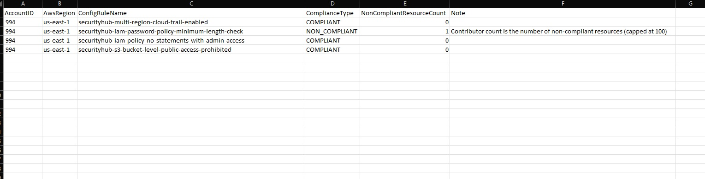

# AWS Config Rule Compliance Audit Lambda

aws-config-rule-audit-lambda is a serverless AWS Lambda function that monitors AWS Config rule compliance across accounts in an organization using a config aggregator. It retrieves a list of target rules from an S3-hosted JSON file, checks their compliance status, and exports results to a CSV in S3. Built with Python, Boto3, and CloudFormation.

## Prerequisites

- **AWS Config Aggregator**: 
    - An active AWS Config aggregator in the AWS account where the Lambda runs (default is the Control Tower management account or organization management account).
    - The aggregator must be set to either specific accounts you want checked or organization wide to the include data you want to check.
- **S3 Bucket**: 
    - S3 bucket to store the input JSON file (containing the list of Config rule identifiers) and the output CSV file.
    - S3 bucket will require object permissions to allow Lambda actions "GetObject" and "PutObject" like below:

```
{
  "Version": "2012-10-17",
  "Statement": [
    {
      "Effect": "Allow",
      "Principal": {
        "AWS": "arn:aws:iam::ACCOUNT_ID:role/LAMBDA_ROLE_NAME"
      },
      "Action": [
        "s3:GetObject",
        "s3:PutObject"
      ],
      "Resource": [
        "arn:aws:s3:::BUCKET_NAME",
        "arn:aws:s3:::BUCKET_NAME/*"
      ]
    }
  ]
}
```

- **IAM Permissions**: The Lambda's IAM role must have permissions for:
  - `config:DescribeAggregateComplianceByConfigRules`
  - `s3:GetObject` (to read the rule list JSON)
  - `s3:PutObject` (to write the CSV output)

## Configuration

The Lambda function relies on environment variables and an event input. Set these as follows:

### Environment Variables
These are set in the Lambda function configuration (AWS Console > Lambda > Configuration > Environment variables) and remain static after deployment:

- **AGGREGATOR_NAME**
  - **Description**: The name of the AWS Config aggregator.
  - **Source**: Find this in the AWS console on AWS Config service, then go under "Aggregators" or via CLI (`aws configservice describe-configuration-aggregators`). Example: `OrgAggregator`.
  - **Example Value**: `MyConfigAggregator`
- **S3_BUCKET**
  - **Description**: The S3 bucket name for both the input JSON file (rule list) and output CSV file.
  - **Source**: Use the name of an existing S3 bucket in your account. Find it in the S3 console or via CLI (`aws s3 ls`).
  - **Example Value**: `aws-config-rule-bucket`
- **S3_RULE_LIST_KEY**
  - **Description**: The S3 object key (path) to the JSON file containing the list of Config rule identifiers to check.
  - **Source**: Create a JSON file in the specified S3 bucket with a list of rule identifiers (e.g., `["vpc-flow-logs-enabled", "AWSControlTower_AWS-GR_DETECT_CLOUDTRAIL_ENABLED_ON_SHARED_ACCOUNTS", "s3-bucket-level-public-access-prohibited"]`). Upload it via S3 console or CLI (`aws s3 cp rules.json s3://my-bucket/config/rules.json`).
  - **Example Value**: `config/org-rules.json`
- **target_account_id**
  - **Description**: The 12-digit AWS account ID to check for Config rule compliance.
  - **Source**: Obtain from your AWS organization (e.g., via AWS Organizations console or CLI: `aws organizations list-accounts`).
  - **Example**: `"123456789012"`

Example event JSON:
```json
{
  "target_account_id": "123456789012"
}
```

## Usage

1. **Deploy the Lambda**: Use the CloudFormation template to deploy the Lambda function, ensuring the environment variables (`AGGREGATOR_NAME`, `S3_BUCKET`, `S3_RULE_LIST_KEY`) are set correctly.
2. **Upload Rule List**: Place a JSON file in the specified S3 bucket at the `S3_RULE_LIST_KEY` path. Example content:
   ```json
   [
     "securityhub-multi-region-cloud-trail-enabled",
     "vpc-flow-logs-enabled",
     "AWSControlTower_AWS-GR_DETECT_CLOUDTRAIL_ENABLED_ON_SHARED_ACCOUNTS",
     "s3-bucket-level-public-access-prohibited"
   ]
   ```
3. **Invoke the Lambda**: Trigger the Lambda via AWS Console, CLI, or an event source (e.g., EventBridge). Provide the event JSON with `target_account_id`.
   - CLI example: `aws lambda invoke --function-name ConfigRuleComplianceChecker --payload '{"target_account_id": "123456789012"}' output.json`
4. **Check Output**: The Lambda generates a CSV file in the S3 bucket at `config_rule_compliance_<account_id>.csv`. Download it from S3 to view compliance results (columns: `AccountID`, `AwsRegion`, `ConfigRuleName`, `ComplianceType`, `NonCompliantResourceCount`, `Note`). Theoutput wuill look like the following image.



## Notes
- Have an IAM role for Cloudformation to deploy the iac template with sufficient permissions to create IAM Role and an AWS Lambda.
- Ensure the S3 bucket exists before invoking the Lambda.
- After the IAC deployed updated the S3 Bucket permissions with the Lambda's IAM role ARN and bucket's access.
- The JSON rule list file must be a valid list of strings, or the Lambda will fail.
- If a rule is not found in the aggregator results, it will appear in the CSV with `ComplianceType: NOT_FOUND` and a note.
- Check Lambda logs in CloudWatch for errors (e.g., missing S3 file, invalid aggregator).